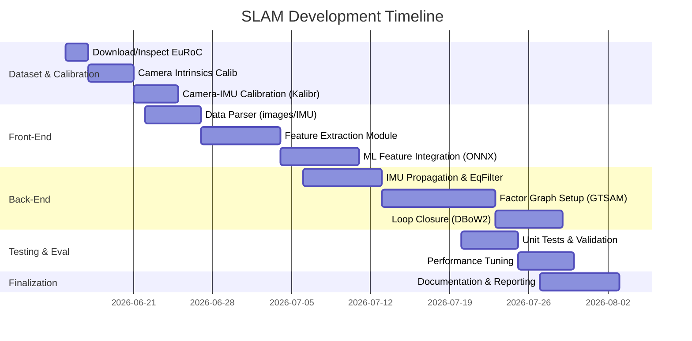

# Executive Summary  
Building a Visual-Inertial SLAM (VI-SLAM) system for the EuRoC MAV dataset involves integrating multiple components: data ingestion, calibration and synchronization, feature-based or learning-based landmark extraction, IMU fusion, state estimation via factor graphs or filters, loop closure, and evaluation.  The EuRoC dataset provides stereo images (WVGA, 20 Hz), synchronized IMU (ADIS16448 at 200 Hz) and calibration data (camera intrinsics, camera–IMU extrinsics).  A typical architecture uses a front-end to preprocess images and extract/match features or deep-learned keypoints, and a back-end for pose optimization.  For real-time odometry, one can implement an Equivariant Kalman Filter (EqVIO) that exploits Lie group symmetry for consistent propagation and update, while maintaining a factor-graph backend (e.g. GTSAM or Ceres) for offline smoothing, map building, and loop closures.  We recommend C++ libraries like GTSAM/G2O/Ceres for optimization, Eigen/Sophus for algebra, OpenCV for images, Kalibr for calibration, and ONNX or TensorRT for ML inference.  Below is a detailed checklist of components and implementation guidance.  

## EuRoC Dataset Overview and Ingestion  
The EuRoC MAV benchmark provides raw data in “ASL” format (separate folders for image streams, IMU logs, calibration, and ground truth).  Each sequence folder contains: `cam0` and `cam1` directories (timestamped left/right image PNGs), an `imu0/data.csv` (timestamped accelerometer+gyroscope measurements), ground truth poses, and sensor YAMLs with intrinsic parameters. Data can also be packaged as ROS bag files.  To ingest, either use ROS APIs (rosbag playback with `image_transport` and `topic_tools`) or custom parsers.  ETH’s [dataset_tools][14] (MATLAB/Python) can parse ASL format; for C++ one can simply read CSV/TXT with `std::ifstream` and load images via OpenCV (`cv::imread`).  For IMU, parse the CSV columns into a struct `(timestamp, ax, ay, az, gx, gy, gz)`.  Ensure timestamps are handled in microseconds (EuRoC uses integer microseconds).  Maintain synchronized queues: store incoming IMU readings and match them to camera frames by timestamp (see Sensor Sync).  

Sensors (STEREO + IMU): EuRoC uses an AscTec Firefly MAV with *stereo global-shutter cameras* (Aptina, 752×480 gray, 20 Hz) and an *MEMS IMU* (InvenSense ADIS16448, 200 Hz).  Camera data are already roughly synchronized (“shutter-centric”), but small offsets may remain.  Calibration files (in `calib` zip or YAML) include camera intrinsics (focal lengths, distortion) and camera–IMU extrinsics.  We will re-use these or recompute with calibration tools.  

**Data Structure (C++):** Define classes/structs for `ImageFrame` (timestamp, stereo cv::Mat images, keypoints, descriptors), `IMUData` (timestamp, accel, gyro), and `Landmark` (3D position, descriptor).  Use `std::vector` or `std::deque` to buffer sequences.  For camera calibration, load intrinsics via `cv::FileStorage` from YAML (fx, fy, cx, cy, distortion) and stereo baseline/rectification parameters.  Precompute undistort/rectify maps with `cv::initUndistortRectifyMap` for each camera to speed up runtime undistortion.  

## Sensor Calibration and Synchronization  
**Camera Intrinsics (OpenCV/Kalibr):** If recalibrating, use a checkerboard or AprilGrid.  With OpenCV: detect corners in captured target images and call `cv::calibrateCamera()` for each camera; for stereo, use `cv::stereoCalibrate()` to get `R`, `T`.  Store results in YAML.  With Kalibr (ETH ASL tool), you can calibrate multiple cameras at once.  *Example:* after collecting images of an AprilTag grid and IMU data, run:  
```
kalibr_calibrate_imu_camera --bag euroc.bag \
  --cam camchain-euroc.yaml \
  --imu imu_adis16448.yaml \
  --target april_6x6.yaml
```  
This outputs `camchain-imucam-*.yaml` with refined intrinsics, the 3×3 rotation and 3×1 translation from IMU→Cam0, and the time offset.  The `imu_adis16448.yaml` should list IMU noise parameters (noise density, bias random walk).  By default Kalibr also estimates the temporal offset; use `--no-time-calibration` to turn off if you trust timestamps.  Copy the resulting extrinsic (e.g. `T_imu_cam`) into your system.  

**IMU Calibration:** EuRoC’s IMU biases (gyro/accel biases) should be estimated.  You can run Kalibr’s **all anvariance** tool (`rosrun kalibr imu_stats`) on static segments to get bias stability.  Alternatively, treat biases as states to estimate in the filter.  

**Temporal Alignment:** EuRoC timestamps are in µs but recorded by different devices.  To synchronize IMU with images, apply the temporal offset found by Kalibr.  In code, you might subtract that offset from all camera timestamps, or interpolate IMU data.  For each camera frame at time t_img, gather all IMU readings between the previous image time and t_img (with any offset).  Optionally, integrate IMU measurements exactly up to t_img using linear interpolation on (accelerometer, gyro) if needed.  Because EuRoC cameras are global-shutter, no rolling-shutter correction is needed, but note that shutter timestamps may correspond to mid-exposure times (Kalibr’s **shutter-centric** alignment).  Always verify alignment by plotting e.g. IMU angular rate spikes against camera frame times.  

## Landmark/Feature Extraction (Front-end)  
**Classical Features:** A simple approach is to use OpenCV detectors (e.g. ORB, FAST+BRIEF, AKAZE, or SuperPoint via C++).  Example using ORB:  
```cpp
cv::Ptr<cv::Feature2D> orb = cv::ORB::create(2000, 1.2f, 8);
vector<cv::KeyPoint> kpts;
cv::Mat desc;
orb->detectAndCompute(grayImage, cv::noArray(), kpts, desc);
```
Store `kpts` (cv::Point2f locations + angle) and `desc` (N×32 uchar matrix).  For stereo, detect on left/right images and match descriptors (BruteForce Hamming + ratio test) to triangulate 3D points.  Save matched keypoint pairs as `Landmark` objects with 3D position (from triangulation) and descriptor.  Maintain a map of observed landmarks.  

**Learned Features:** Modern deep models (SuperPoint, R2D2, D2-Net, etc) often yield more robust keypoints/descriptors.  For C++ integration, convert pre-trained models to ONNX or TensorRT.  For example, with ONNX-Runtime:  
```cpp
Ort::SessionOptions opts; Ort::Session session(env, "superpoint.onnx", opts);
vector<int64_t> dims = {1,1,H,W}; // HxW gray image
Ort::Value inputTensor = Ort::Value::CreateTensor<float>(allocator, imgData, H*W, dims.data(), dims.size());
auto outputTensors = session.Run(run_opts, &inputName, &inputTensor, 1, &outputNames, 2);
// output[0]: keypoint heatmap, [1]: descriptors
```
Parse outputs to (x,y) keypoint locations and 256-D descriptors.  SuperGlue (another network) can be used for matching between frames given SuperPoint features, but simpler is nearest-neighbor matching of descriptors followed by RANSAC.  Once matched across stereo or multiple views, 3D-landmarks are built as usual.  

**Landmark Data Structures:** Use a struct with fields: `id`, 3D position (`Eigen::Vector3d`), descriptor (`vector<float>`), and observation history (list of frames & keypoint indices).  Manage landmark creation: upon successful triangulation or stereo matching, assign a new ID.  Fuse duplicates by checking proximity in 3D.  

## Visual Odometry and State Propagation  
Perform frame-to-frame pose estimation using IMU and vision.  There are two main options: a filter (e.g. EqVIO) or incremental optimization (sliding-window filter or frame-by-frame PnP + IMU).  We focus on EqVIO and factor-graph approaches.  

**IMU Propagation:** In either case, propagate orientation, velocity, and position via mechanization equations.  Represent orientation by quaternion or rotation matrix.  For small $\Delta t$, discretize as:  
$$R_{k+1} = R_k \exp((\omega_k - b_g)\Delta t),\quad v_{k+1} = v_k + (R_k (a_k - b_a) + g)\,\Delta t,\quad p_{k+1} = p_k + v_k\Delta t + \frac12 (R_k (a_k - b_a) + g)\Delta t^2.$$  
Subtract estimated gyro bias $b_g$ and accel bias $b_a$, and add gravity $g$ (0,0,-9.81).  Implement `Exp(ω×dt)` with Rodrigues or quaternion integration.  In C++/Eigen:  
```cpp
Eigen::Vector3d omega = imu.gyro - state.bg;
double angle = omega.norm()*dt;
Eigen::Matrix3d R_inc = Eigen::AngleAxisd(angle, omega.normalized()).toRotationMatrix();
state.R = state.R * R_inc;
```
Then update `state.v`, `state.p` as above.  Maintain covariance $P$ by computing state-transition Jacobian $F$ and process noise $Q$:  
```cpp
Eigen::Matrix<double,15,15> F; // derive analytically 
// Fill F using partials (see IMU preintegration literature, e.g. Forster 2015)
// Then: P = F*P*F^T + Q;
```
For numerical stability, normalize quaternions every few steps and ensure small-angle assumption is handled properly.  

**EqVIO Filter:** EqVIO formulates VIO on a novel Lie-group (“VI-SLAM group”) that makes the IMU dynamics *group-affine*.  In practice, its state is $x = (R,p,v,b_g,b_a)$ on a manifold.  The equivariant Kalman filter maintains an error covariance on this state.  The key benefit is that linearization errors depend only on bias and noise, not state estimate, improving consistency.  The **propagation** step is as above (group-affine integration).  The **update** step uses visual measurements: for a known 3D landmark $X$, the expected bearing is $\pi(R^T(X-p))$ (project to normalized image coords).  The innovation is $y = z - \pi(\dots)$, and its Jacobian w.r.t. the state is derived (can follow standard EKF VIO Jacobians).  EqVIO uses a higher-order *equivariant output approximation*, but you can implement the EKF update as:  
```cpp
// For each observed landmark:
Eigen::Vector3d Xcam = state.R.transpose() * (landmark.X - state.p);
Eigen::Vector2d z_pred(fx*Xcam.x()/Xcam.z(), fy*Xcam.y()/Xcam.z());
Eigen::Vector2d y = z_obs - z_pred;
Eigen::Matrix<double,2,15> H; // derive ∂z/∂[R,p,v,b] here
Eigen::Matrix2d S = H*P*H.transpose() + R_noise;
Eigen::Matrix<double,15,2> K = P*H.transpose()*S.inverse();
Eigen::Matrix<double,15,1> dx = K * y;
state = retract(state, dx); // apply on manifold
P = (Eigen::Matrix<double,15,15>::Identity() - K*H) * P;
```
Compute $H$ by differentiating the projection w.r.t. small perturbations in rotation (use $\hat{\theta}\approx \theta$), position, etc.  Detailed Jacobians are given in Appendix of EqVIO paper.  Maintain numerical stability by normalizing quaternions and using double precision.  

EqVIO results: Van Goor & Mahony report that EqVIO “outperforms other state-of-the-art VIO algorithms on EuRoC… in speed and accuracy”.  This indicates it is suitable for real-time VIO.  However, if implementing from scratch, one could also use a standard IEKF or MSCKF scheme.  

## Factor-Graph Backend  
A factor-graph backend performs batch or sliding-window optimization.  We recommend GTSAM (C++), Ceres (C++), or g2o as libraries.  

**Graph Structure:** Each camera keyframe is a node with a pose (and optionally velocity/bias).  Landmarks are nodes (or use projection factors to marginalize them).  Factors include: IMU preintegration factors (between consecutive poses), visual projection factors (pose–landmark observation), and loop-closure factors.  For example, in GTSAM:  
```cpp
NonlinearFactorGraph graph;
Values initialEstimate;
KeyVector keys; // for Pose3, velocities, biases, landmarks

// Prior on first pose
Pose3 priorMean = Pose3(R0, p0);
auto priorNoise = noiseModel::Diagonal::Sigmas({1e-3,1e-3,1e-3, 0.1,0.1,0.1});
graph.add(PriorFactor<Pose3>(PoseKey(0), priorMean, priorNoise));

// Add IMU factors for each timestep
IMUPreintegrated imu_preint(prevBias, imuParams);
for each imu measurement: imu_preint.integrateMeasurement(acc, gyro, dt);
graph.add(ImuFactor(prevPoseKey, prevVelKey, currPoseKey, currVelKey, biasKey, imu_preint, imuNoiseModel));

// Add visual factors (one per keypoint obs)
Point3 landmark3d(X,Y,Z);
graph.add(GenericProjectionFactor<Cal3_S2>(
    z_uv, pointNoise, PoseKey(i), LandKey(j), K));
```
Run optimization (`LevenbergMarquardtOptimizer`) to obtain refined states.  GTSAM’s [`ImuFactor`][20] supports 5-way between (pose_i, vel_i, pose_j, vel_j, bias).  If using Ceres, the same factors are implemented as residual blocks: e.g. the **IMU residual** as in [Forster et al. 2015] for preintegrated IMU, and **reprojection residuals** using camera intrinsics.  

GTSAM is BSD-licensed and well-documented.  It provides symbol keys (e.g. `Symbol('x',i)` for pose i) to index nodes.  GTSAM’s `Values` holds the initial guess (fill from IMU propagation or previous frame).  The factor graph handles nonlinearities; after convergence you can extract optimized poses and landmark positions.  Use `Marginals` (GTSAM) or `ComputeCovariances` (Ceres) if uncertainty is needed.  

**Map Representation:** The map is a sparse set of 3D points (landmarks) with associated descriptors.  In the graph approach, either explicitly keep a vector of `Eigen::Vector3d` landmarks or embed them as nodes in the optimization.  A simple map container is `std::vector<Landmark>` storing current best 3D points.  After each optimization, update the map from the graph’s values.  For large maps, consider pruning points observed in few views or behind camera.  For visualization, one might use PCL or write the points to PLY.  

## Loop Closure  
To handle drift, implement loop closure detection.  Use a place-recognition library (DBoW2, DBoW3) or deep descriptors (NetVLAD) on keyframe descriptors.  Maintain a database of keyframes; when the current frame matches an old one, compute a relative pose via RANSAC on feature correspondences.  If successful, add a **loop closure factor** to the graph: a BetweenFactor between the two pose keys.  For example:  
```cpp
Pose3 loopRel = estimatePose(frame_j, frame_i);  
auto loopNoise = noiseModel::Diagonal::Sigmas(vector<double>{0.5,0.5,0.5, 0.1,0.1,0.1});
graph.add(BetweenFactor<Pose3>(PoseKey(i), PoseKey(j), loopRel, loopNoise));
```
Re-optimize the graph to enforce consistency.  ORB-SLAM2/3 uses a place-search and BA in the background; you can do the same (thread the loop detection so as not to block odometry).  Loop closure can greatly reduce drift in long runs.  

## ML-based Landmark Integration  
For “learned landmarks”, one approach is to detect semantic or planar features: e.g. use a pre-trained keypoint network on each image and match keypoints as above.  For example, use SuperPoint (bookmarks in code) as described, or LoFTR (which directly outputs dense correspondences without descriptors).  To train on EuRoC, one could project the provided laser-scanner 3D points into images and sample 3D–2D correspondences; however, often pre-trained on COCO/photometric warps is sufficient.  After inference, integrate the new keypoints exactly like classical features.  In factor graph terms, these are just additional landmarks.  

For integration: convert the neural net output (floating-point coords) to `cv::Point2f` and maintain an index.  Fuse learned and traditional features by e.g. merging maps.  One could also train a network to predict 3D depth or VIO updates from images, but that is beyond the SLAM pipeline focus.  

## Performance and Real-Time Considerations  
To achieve real-time: separate **front-end** and **back-end** threads.  The front-end grabs images/IMU, extracts features (use GPU for CNNs if possible), matches, and does a quick pose update (e.g. EqVIO or PnP+IMU).  The back-end maintains the factor graph and runs optimizations less frequently (keyframe interval or in idle time).  Use incremental solvers like iSAM2 (in GTSAM) to update only new factors.  Fix a sliding window or marginalize old states to bound computation.  

Use efficient data structures (Eigen for math, std::vector with reserve).  For example, triangulate stereo via OpenCV (`cv::triangulatePoints`) which is optimized.  Use `-O3` and link with optimized BLAS (Eigen often uses vectorization).  If using ONNX/TensorRT, enable GPU inference for feature networks.  Lower-latency tips: limit the number of features (e.g. 500–1000) per frame, use coarse-to-fine matching, and perform check-pointing of static map points.  

## Testing and Evaluation  
Validate the system on EuRoC’s ground truth.  Common metrics: Absolute Trajectory Error (ATE) and Relative Pose Error (RPE) as in [evo][] (Python) or TUM’s evaluation scripts.  Compute RMSE of translation and rotation over each sequence.  For example, run `evo_ape euroc/groundtruth.txt estimated.txt`.  Also check IMU bias convergence and scale (if monocular).  Test edge cases: rapid motion (e.g. Vicon Room “difficult” sequences), darkness (VINS-Fusion notes flash), and feature-poor scenes.  

Run ablation experiments: with/without loop closure, using only ORB vs ORB+SuperPoint, stereo vs mono.  Compare against published results: EqVIO authors report sub-cm ATE on EuRoC; ORB-SLAM2 achieves ~1% trajectory error.  Document experiments (e.g. a table of ATE for MH_01_easy, V1_03_difficult, etc.).  

Automate with ROS bags or batch scripts.  Use unit tests for individual components (e.g. verify calibration yields correct re-projection error, IMU integration on synthetic data matches known motion).  

## Project Structure and Build Pipeline  
A recommended C++ project layout:  

```
VioSlamProject/  
├─ CMakeLists.txt  
├─ src/  
│   ├─ main.cpp            # program entry  
│   ├─ DataLoader.cpp      # reads EuRoC data (images, IMU)  
│   ├─ Preprocessor.cpp    # undistort/rectify, sync  
│   ├─ Frontend.cpp        # image feature extraction & matching  
│   ├─ EqVIO.cpp           # EqF implementation (propagate, update)  
│   ├─ Backend.cpp         # factor graph manager (GTSAM/Ceres calls)  
│   ├─ LoopClosure.cpp     # DBoW2 integration, pose graph  
│   ├─ Utils.cpp           # common math, constants  
│   └─ ...  
├─ include/               # header files for classes above  
├─ tests/  
│   ├─ test_calibration.cpp  
│   ├─ test_eqvio.cpp  
│   └─ ...  
├─ config/                # YAML configs (camera, imu noise, EqVIO params)  
├─ data/                  # sample or symlink to EuRoC bag  
└─ libs/                  # third-party libs (if needed)  
```

Use CMake to find packages: e.g. find_package(Eigen3), OpenCV, yaml-cpp, GTSAM, Ceres, etc.  Encapsulate image frames, landmarks, and state in classes (e.g. `class Frame`, `class Landmark`, `class StateEkf`).  For the EqF filter, have a class `EqVioFilter` with methods `propagate(IMUData)` and `update(Observations)`.  For GTSAM, a `GraphOptimizer` class can wrap `NonlinearFactorGraph` and hold the `Values`.  

Set up a CI (GitHub Actions or Travis) to build and run basic tests.  Tests can include checking the output of `cv::calibrateCamera` on synthetic data, EqVIO propagation consistency, or that known trajectory segments are correctly reconstructed.  

**Table: Library Options Comparison**

| **Component**            | **Library/Tool**    | **Language/License** | **Features**                                          | **Notes**                                   |
|--------------------------|---------------------|----------------------|-------------------------------------------------------|---------------------------------------------|
| Optimization Backend     | GTSAM | C++/BSD             | Factor graphs, IMU/Pose factors, iSAM2               | Popular, good docs, uses Eigen             |
|                          | Ceres Solver         | C++/BSD             | NLLS, autodiff, common use in VIO (VINS uses it)     | No built-in factor API (use manually)      |
|                          | g2o                  | C++/BSD             | Graph optimization, plugin-based                     | Used in OpenVSLAM, lighter than GTSAM      |
| Feature Detection        | OpenCV (ORB, FAST)   | C++/BSD             | Fast, classic, many built-in detectors (ORB, AKAZE)   | ORB: rotation-scale invariant, free       |
|                          | SuperPoint/SuperGlue (via ONNX) | C++(Python)/Various | Learned, high-quality keypoints/descriptors          | More robust in texture-poor scenes         |
| Camera Calibration       | Kalibr | MATLAB/C++         | Stereo & IMU calibration with time alignment         | Gold standard for VI sensors               |
|                          | OpenCV               | C++/BSD             | Standard intrinsics/distortion calibration           | Requires checkerboard patterns             |
| Vocabulary/Place Recognition | DBoW2/DBoW3          | C++/GPL or BSD      | Bag-of-Words, used in ORB-SLAM, loop detection       | Needs ORB features and vocab file          |
| Visualization            | Pangolin            | C++/BSD             | 3D visualization (camera, map)                       | E.g. used by ORB-SLAM                     |
| Linear Algebra           | Eigen  | C++/MPL2           | Vectors, matrices, Lie groups (with Sophus)          | High-performance, header-only              |
| Neural Inference         | ONNX Runtime        | C++/Apache-2        | Run ONNX models cross-platform                       | CPU/GPU support                             |
|                          | TensorRT (NVIDIA)   | C++/NVIDIA-License  | Optimized GPU inference for Cuda                     | High performance for vision networks       |

## Development Roadmap (Gantt Chart)  
Below is a sample timeline (each span indicates an estimated duration). You can adjust dates as needed.  
  


Each phase can overlap as appropriate.  Early tasks involve getting data and calibration right; then implement the front-end, then the back-end, followed by integration and tuning.  

**Sources:** We have relied primarily on the EuRoC dataset documentation, the EqVIO paper and code, Kalibr documentation, and standard SLAM resources (GTSAM tutorial, OpenVSLAM examples, etc.). These resources provide implementation details and best practices for each component.  

